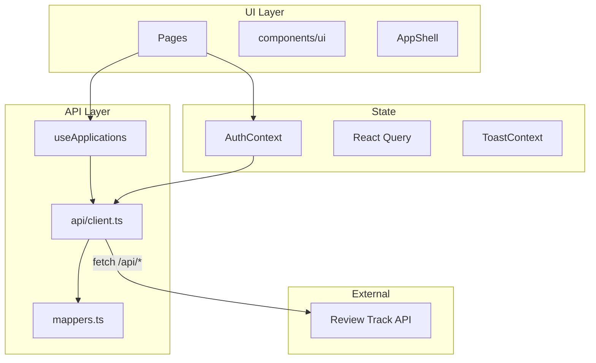

# ReviewTrack

ReviewTrack is a web application for managing application review workflows. Applicants create and submit requests; reviewers process them through a queue with approve, reject, and request-changes actions. This repository contains the **frontend SPA** built with React, TypeScript, and Vite.

The UI talks to an external Review Track API over REST. The OpenAPI specification lives in [`openapi/api.json`](openapi/api.json).

---

## Table of contents

- [Features](#features)
- [Tech stack](#tech-stack)
- [Prerequisites](#prerequisites)
- [Quick start](#quick-start)
- [Environment variables](#environment-variables)
- [Available scripts](#available-scripts)
- [Project structure](#project-structure)
- [Architecture](#architecture)
- [Routes and roles](#routes-and-roles)
- [API integration](#api-integration)
- [UI and design system](#ui-and-design-system)
- [Email templates](#email-templates)
- [Production deployment](#production-deployment)
- [Troubleshooting](#troubleshooting)

---

## Features

### Applicant

- Sign in with JWT authentication
- Dashboard with stats and application list
- Create and edit draft applications
- Submit applications for review
- View application detail and activity timeline
- Edit and resubmit after changes are requested
- Delete drafts

### Reviewer

- Review queue with filters (active, submitted, under review, changes, **approved**, rejected)
- Start review on submitted applications
- Approve, reject, or request changes (with optional comments)
- View applicant details and full activity history
- Add comments on applications

### UX

- Organic green ReviewTrack theme (Inter + Playfair Display)
- Skeleton loading states for lists and detail pages
- Form submit guards, loading spinners, and 30s API timeout
- Toast notifications for success and error feedback
- Responsive layout with mobile sidebar

---

## Tech stack

| Layer | Technology |
|-------|------------|
| Framework | React 18 |
| Language | TypeScript |
| Build | Vite 6 |
| Styling | Tailwind CSS v4 (`@tailwindcss/vite`) |
| Routing | React Router 7 |
| Data fetching | TanStack React Query 5 |
| Icons | Lucide React |
| API types | `openapi-typescript` from OpenAPI spec |

---

## Prerequisites

- **Node.js** 18+ (20+ recommended)
- **npm** 9+
- A running **Review Track API** (default dev target: `http://localhost:8000`)

---

## Quick start

### 1. Clone and install

```bash
git clone <repository-url>
cd review-track
npm install
```

### 2. Configure environment

Copy the example env file to the **project root** (not `src/`):

```bash
cp .env.example .env
```

Edit `.env` if your API runs on a different host:

```env
VITE_API_PROXY_TARGET=http://localhost:8000
```

### 3. Start the API

Ensure the Review Track backend is running and reachable at the proxy target URL. The frontend expects JSON responses in the shape `{ success: boolean, data?: T, message?: string }`.

### 4. Run the dev server

```bash
npm run dev
```

Open the URL shown in the terminal (typically `http://localhost:5173`). Vite proxies all `/api/*` requests to `VITE_API_PROXY_TARGET`.

### 5. Sign in

The login screen includes applicant and reviewer role tabs with demo email hints. Use credentials that exist in your API (default demo password in the UI is `demo-password`).

| Role | Demo email (UI default) |
|------|-------------------------|
| Applicant | `alex.morgan@company.com` |
| Reviewer | `jordan.lee@company.com` |

Actual users and passwords are defined by your backend.

---

## Environment variables

| Variable | Required | Default | Description |
|----------|----------|---------|-------------|
| `VITE_API_PROXY_TARGET` | Dev only | `http://localhost:8000` | Backend URL for the Vite dev proxy (`/api` → backend) |
| `VITE_API_BASE_URL` | Production | `""` (empty) | Base URL prepended to API paths at **build time**. Leave empty to use relative `/api` paths (same origin or reverse proxy) |

**Development:** requests go to `/api/...` on the Vite origin; the proxy forwards them to the backend.

**Production:** build with the appropriate base URL:

```bash
# Same host — API served under /api via nginx or similar
VITE_API_BASE_URL= npm run build

# Separate API host
VITE_API_BASE_URL=https://api.example.com npm run build
```

Never commit `.env` files. They are listed in `.gitignore`.

---

## Available scripts

| Command | Description |
|---------|-------------|
| `npm run dev` | Start Vite dev server with HMR and API proxy |
| `npm run build` | Typecheck and produce production build in `dist/` |
| `npm run preview` | Serve the production build locally |
| `npm run codegen` | Regenerate `src/api/schema.d.ts` from `openapi/api.json` |
| `npm run verify:email` | Validate themed email template colors and generate HTML previews |
| `npm run lint` | Run ESLint (requires `eslint.config.js` to be configured) |

---

## Project structure

```
review-track/
├── openapi/
│   └── api.json              # OpenAPI spec (source for codegen)
├── email-templates/
│   ├── buildStatusEmail.ts   # Themed status email (paste into backend)
│   ├── verify-theme.mjs      # Theme verification script
│   └── previews/             # Generated HTML previews (after verify:email)
├── src/
│   ├── api/
│   │   ├── client.ts         # REST client, apiFetch, endpoint functions
│   │   ├── mappers.ts        # API ↔ UI model mapping
│   │   ├── schema.d.ts       # Generated OpenAPI types
│   │   └── token.ts          # JWT + user persistence (localStorage)
│   ├── components/
│   │   ├── ui/               # Reusable primitives (Button, Card, Table, …)
│   │   ├── ActivityTimeline.tsx
│   │   └── ToastStack.tsx
│   ├── context/
│   │   ├── AuthContext.tsx     # Login, logout, session bootstrap
│   │   └── ToastContext.tsx
│   ├── hooks/
│   │   └── useApplications.ts # React Query hooks for all app mutations/queries
│   ├── layout/
│   │   └── AppShell.tsx        # Sidebar, top bar, navigation
│   ├── pages/                  # Route-level screens
│   ├── routes/
│   │   └── ProtectedLayout.tsx # Auth + role guards
│   ├── types/
│   │   └── ui.ts               # UI-facing types and enums
│   ├── lib/
│   │   ├── cn.ts               # Tailwind class merge helper
│   │   └── use-submit-lock.ts  # Double-submit guard for forms
│   ├── App.tsx                 # Route definitions
│   ├── main.tsx                # App entry + providers
│   └── index.css               # Tailwind + design tokens (@theme)
├── index.html
├── vite.config.ts
├── .env.example
└── package.json
```

---

## Architecture



**Data flow**

1. Pages call React Query hooks from `useApplications.ts`.
2. Hooks invoke functions in `api/client.ts`.
3. `apiFetch` attaches the JWT, applies a 30s timeout, and parses the success envelope.
4. `mappers.ts` converts API models (e.g. `UNDER_REVIEW`) to UI models (`under_review`).
5. React Query caches and revalidates; mutations invalidate related query keys.

**Authentication**

- Login returns a JWT stored in `localStorage` (`approvalflow_token`).
- On boot, `AuthContext` calls `/api/auth/me` to refresh the user if a token exists.
- Protected routes redirect unauthenticated users to `/login`.
- Role-specific routes (`applicant` / `reviewer`) redirect to the correct home if the role mismatches.

---

## Routes and roles

| Path | Role | Page |
|------|------|------|
| `/login` | Public | Login |
| `/` | Authenticated | Redirect to dashboard or queue |
| `/dashboard` | Applicant | Application list and stats |
| `/applications/new` | Applicant | Create application |
| `/applications/:id/edit` | Applicant | Edit application |
| `/applications/:id` | Both | Application detail |
| `/queue` | Reviewer | Review queue |
| `/profile` | Both | Profile and sign out |

---

## API integration

The client is implemented manually in [`src/api/client.ts`](src/api/client.ts). Key endpoints:

### Auth

- `POST /api/auth/login`
- `GET /api/auth/me`
- `POST /api/auth/logout`

### Applicant

- `GET /api/applications/my`
- `GET /api/applications/:id`
- `POST /api/applications`
- `PATCH /api/applications/:id`
- `DELETE /api/applications/:id`
- `PATCH /api/applications/:id/submit`
- `GET /api/applications/:id/events`
- `POST /api/applications/:id/comments`

### Reviewer

- `GET /api/reviewer/applications`
- `GET /api/reviewer/applications/:id`
- `POST /api/reviewer/applications/:id/start-review`
- `POST /api/reviewer/applications/:id/approve`
- `POST /api/reviewer/applications/:id/reject`
- `POST /api/reviewer/applications/:id/return`

### Regenerating types

When the API spec changes, update `openapi/api.json` and run:

```bash
npm run codegen
```

This updates [`src/api/schema.d.ts`](src/api/schema.d.ts). The runtime client may still need manual updates if new endpoints are added.

---

## UI and design system

Design tokens are defined in [`src/index.css`](src/index.css) via Tailwind v4 `@theme`:

| Token | Value | Usage |
|-------|-------|--------|
| `brand` | `#1A302A` | Primary actions, headings |
| `brand-muted` | `#E9F0E9` | Active nav, approved badges |
| `canvas` | `#F9F9F7` | Page background |
| `sidebar` | `#F4F4F2` | Sidebar background |
| `tan` / `tan-text` | `#F5EBE0` / `#6B5344` | Submitted / changes badges |

**Fonts:** Inter (UI), Playfair Display (headings), JetBrains Mono (labels, dates).

**Primitives** live under [`src/components/ui/`](src/components/ui/): `Button`, `Card`, `Badge`, `Table`, `Dialog`, `StatsBar`, `ApplicationList`, `Skeleton`, etc.

---

## Email templates

Status notification emails for the backend are maintained in [`email-templates/buildStatusEmail.ts`](email-templates/buildStatusEmail.ts). Colors match the web UI. Copy this file into your API project’s email module.

Verify theme colors and generate HTML previews:

```bash
npm run verify:email
```

See [`email-templates/README.md`](email-templates/README.md) for badge color reference.

---

## Production deployment

This app is a **static SPA**. Deploy the contents of `dist/` after building.

### Build

```bash
npm run build
```

Output: `dist/` (HTML, JS, CSS).

### Hosting options

- **Same origin:** serve `dist/` and proxy `/api` to the backend (nginx, Caddy, etc.)
- **Static host + separate API:** set `VITE_API_BASE_URL` at build time and configure API CORS

### Pre-deploy checklist

- [ ] API is running and reachable from the browser
- [ ] `VITE_API_BASE_URL` set correctly for your hosting layout
- [ ] CORS configured if API is on a different domain
- [ ] `npm run build` succeeds
- [ ] Smoke test: login, create/submit application, reviewer queue actions
- [ ] Backend email template updated from `email-templates/` if using status emails

### Preview production build locally

```bash
npm run build
npm run preview
```

Note: `preview` does not proxy `/api` by default. Use a full stack proxy or point `VITE_API_BASE_URL` at a running API for end-to-end testing.

---

## Troubleshooting

| Issue | Likely cause | Fix |
|-------|----------------|-----|
| API calls fail in dev | Backend not running | Start API on `VITE_API_PROXY_TARGET` |
| API calls fail in prod | Wrong `VITE_API_BASE_URL` or CORS | Rebuild with correct URL; fix API CORS headers |
| Login works but data empty | Token invalid or wrong API | Check network tab; verify `/api/auth/me` |
| Forms feel stuck | Slow/hung API | Client times out after 30s; check backend logs |
| `.env` not applied | File in wrong directory | Place `.env` in project root, not `src/` |
| `npm run lint` fails | No ESLint flat config | Add `eslint.config.js` or rely on `tsc` + build |

---

## License

Private project. See repository owner for license terms.
